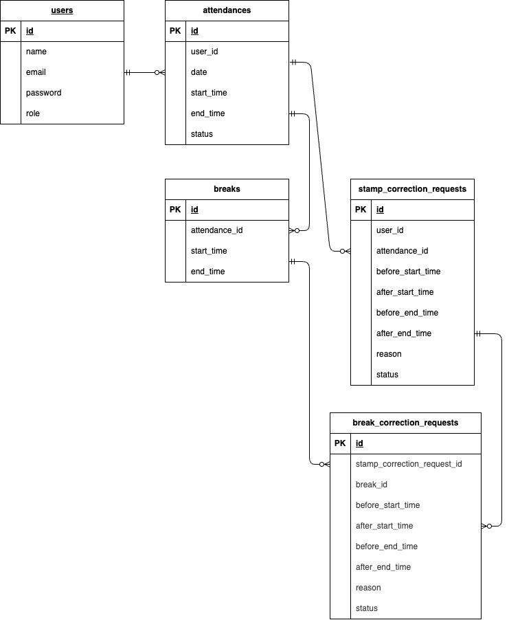

## アプリケーション名

勤怠管理アプリ

## 環境構築

1,Docker コンテナを起動

```
docker-compose up -d --build
```

2,php コンテナ内で Laravel の初期設定を行う
.env の作成 アプリケーションキーを生成

```
docker-compose exec php bash
composer install
cp .env.example .env
php artisan key:generate
```

3,データベースの接続設定を行う
.env の修正

```
DB_CONNECTION=mysql
DB_HOST=mysql
DB_PORT=3306
DB_DATABASE=laravel_db
DB_USERNAME=laravel_user
DB_PASSWORD=laravel_pass
```

4,マイグレーションを実行

```
php artisan migrate
```

5,シーディングを実行

```
php artisan db:seed
```

6,シンボリックリンクを作成

```
php artisan storage:link
```

## テスト環境構築

テスト用データベースの作成

```
docker-compose exec mysql bash
mysql -u root -p
CREATE DATABASE demo_test;
```

srcディレクトリでテスト用の.envファイルの作成

```
cp .env .env.testing
```

```
APP_ENV=test
DB_DATABASE=demo_test
DB_USERNAME=root
DB_PASSWORD=root
```

テスト用のテーブルの作成

```
docker-compose exec php bash
php artisan key:generate --env=testing
php artisan migrate --env=testing
```

テストの実行

```
php artisan test
```

## テストユーザー

```
管理者
メールアドレス:admin@test.com
パスワード:password
一般ユーザー
メールアドレス:user@test.com
パスワード:password
```

## 使用技術

PHP：8.1.34
Laravel：8.83.8
mysql：8.0.26
nginx：1.21.1

## ER 図



## URL

```
トップページ：http://localhost/
会員登録：http://localhost/register
ログイン：http://localhost/login
```
